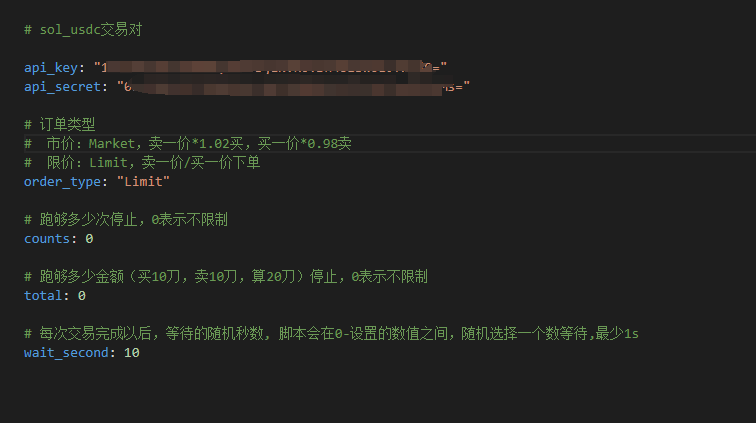
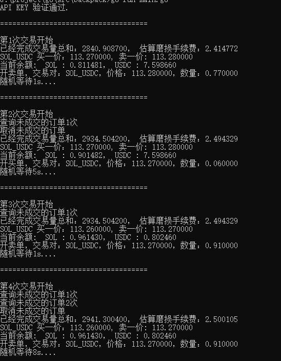

# config.yaml

## order_type ：Limit/Market
 订单类型 (只针对买单，卖单统一走市价，防止持有sol下跌造成亏损)
  市价：Market，卖一价*1.02买，买一价*0.98卖
  限价：Limit，只挂单不吃单，卖一价/买一价下单

## counts : 0
跑够多少次停止，0表示不限制
## total: 0
跑够多少金额（买10刀，卖10刀，算20刀）停止，0表示不限制

## wait_second: 20
 每次交易完成以后，等待的随机秒数, 脚本会在0-设置的数值之间，随机选择一个数等待,最少1s

# 效果展示

## 实际跑下来，磨损大概在万9-万10之间，效果还是比较不错

# 写脚本不容易，跑脚本的可以用我的邀请链接注册（哎，炒币亏了大几千刀）
https://backpack.exchange/refer/cfbd5a15-f9ce-481a-a323-0aaf5e51091f
# 私信联系的较多，创建了1个交流群，我会不定时的编写比较火的项目脚本，有需要的可以加群

# 脚本下载链接
https://github.com/daxiong9526/backpack/releases/tag/release1.0.0

# 已知问题
## 1. win版本打开闪屏退出
apikey和apisecret配置不正确，填写正确即可
